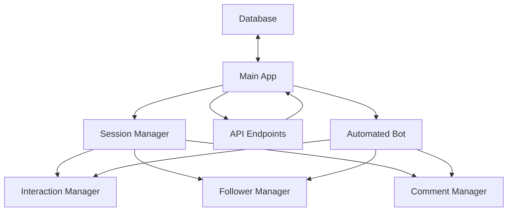
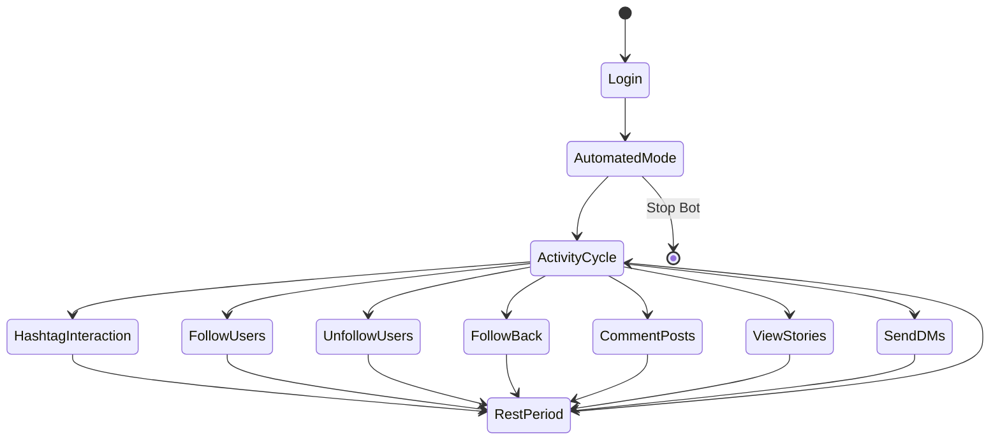
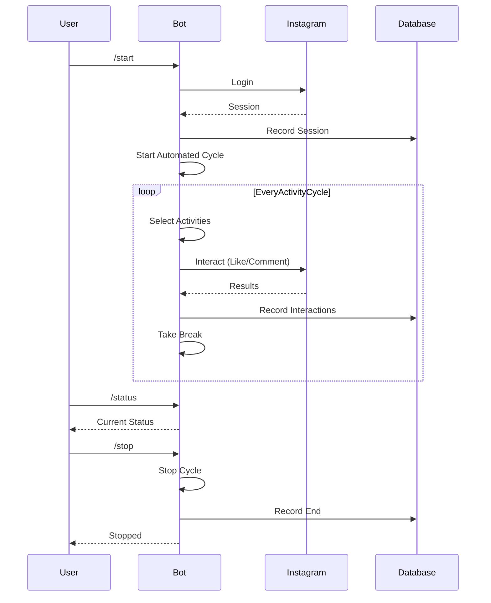

# Instagram Bot

بات هوشمند اینستاگرام برای تعامل خودکار و افزایش فالوور

## ویژگی های اصلی

- لایک کردن خودکار پست ها
- کامنت گذاری هوشمند
- فالو و آنفالو خودکار
- مشاهده استوری
- ارسال پیام مستقیم
- تعامل بر اساس هشتگ
- رفتار انسانی با استراحت های تصادفی
- ثبت آمار و گزارش عملکرد

## معماری سیستم



## راه اندازی

### پیش نیازها

- Docker و Docker Compose
- حساب کاربری اینستاگرام 

### مراحل نصب

1. کلون کردن مخزن:
```bash
git clone https://github.com/yourusername/instagram-bot.git
cd instagram-bot
```

2. ایجاد فایل `.env`:
```
INSTAGRAM_USERNAME=your_instagram_username
INSTAGRAM_PASSWORD=your_instagram_password
```

3. راه اندازی با Docker:
```bash
docker-compose up -d
```

4. بررسی وضعیت:
```bash
docker logs instagram_bot -f
```

## شروع کار خودکار

بات به صورت پیش فرض پس از راه اندازی به حالت خودکار می رود. اما می توانید با API های زیر آن را کنترل کنید:

```bash
# شروع بات و حالت خودکار
curl -X POST http://localhost:8000/start

# بررسی وضعیت
curl http://localhost:8000/status

# توقف بات
curl -X POST http://localhost:8000/stop

# روشن/خاموش کردن حالت خودکار
curl -X POST http://localhost:8000/auto-mode/on
curl -X POST http://localhost:8000/auto-mode/off
```

## چرخه کاری بات



## API های موجود

### مدیریت بات

| آدرس | متد | توضیحات |
|------|------|----------|
| `/start` | POST | راه اندازی بات |
| `/stop` | POST | توقف بات |
| `/status` | GET | دریافت وضعیت بات |
| `/auto-mode/{state}` | POST | تنظیم حالت خودکار (on/off) |

### آمار و اطلاعات

| آدرس | متد | توضیحات |
|------|------|----------|
| `/api/stats/daily` | GET | آمار روزانه بات |
| `/api/stats/weekly` | GET | آمار هفتگی بات |
| `/api/stats/monthly` | GET | آمار ماهیانه بات |
| `/api/stats/summary` | GET | خلاصه آماری بات |

### مدیریت تعاملات

| آدرس | متد | توضیحات |
|------|------|----------|
| `/api/interactions/recent` | GET | تعاملات اخیر |
| `/api/interactions/by-type/{type}` | GET | تعاملات بر اساس نوع |
| `/api/interactions/by-username/{username}` | GET | تعاملات با یک کاربر خاص |
| `/api/interactions/filter` | GET | فیلتر کردن تعاملات |
| `/api/interactions/summary` | GET | خلاصه تعاملات |
| `/api/interactions/most-interacted` | GET | کاربران با بیشترین تعامل |

## نحوه کارکرد



## تنظیمات پیشرفته

تنظیمات بات در فایل `app/config.py` قرار دارد:

- `MIN_ACTION_DELAY` و `MAX_ACTION_DELAY`: تاخیر بین عملیات‌ها (ثانیه)
- `MIN_BREAK_TIME` و `MAX_BREAK_TIME`: زمان استراحت (دقیقه)
- `ACTIVITY_WEIGHTS`: اولویت بندی فعالیت‌ها

## سفارشی سازی محتوا

- کامنت‌ها: ویرایش فایل `data/comments.json`
- هشتگ‌ها: ویرایش فایل `data/hashtags.json`